# Admin Panel — Mermaid Flow Diagrams

## 1. High-Level System Flow

```mermaid
flowchart TD
    Login[🔐 Login Page]
    AuthCheck{Check Role}
    AdminDash[📊 Admin Dashboard]
    StaffDash[📊 Staff Dashboard]
    IndivDash[📊 Individual Dashboard]

    Login --> AuthCheck
    AuthCheck -->|Admin| AdminDash
    AuthCheck -->|Staff| StaffDash
    AuthCheck -->|Individual| IndivDash

    subgraph AdminCapabilities [Admin Capabilities]
        direction TB
        SM[👥 Staff Management]
        SA[📅 Staff Availability]
        SEA[🔗 Staff-Event Assignment]
        SSH[📜 Staff Service History]
        AC[🔒 Access Control]
    end

    subgraph SharedCapabilities [Shared Capabilities — Admin & Staff]
        direction TB
        CE[➕ Create / Edit Events]
        MA[📋 Mark Attendance]
        MH[📂 My Event History]
        MP[👤 My Profile]
        AT[🟢 Availability Toggle]
    end

    subgraph IndividualCapabilities [Individual Capabilities]
        direction TB
        BE[🔍 Browse Published Events]
        BS[🎟️ Book Sessions]
        ME[📂 My Booked Events]
        AH[📊 Attendance History]
        IP[👤 My Profile]
    end

    AdminDash --> AdminCapabilities
    AdminDash --> SharedCapabilities
    StaffDash --> SharedCapabilities
    IndivDash --> IndividualCapabilities

    style AdminCapabilities fill:#fef3c7,stroke:#f59e0b,stroke-width:2px
    style SharedCapabilities fill:#dbeafe,stroke:#3b82f6,stroke-width:2px
    style IndividualCapabilities fill:#d1fae5,stroke:#10b981,stroke-width:2px
    style Login fill:#f3f4f6,stroke:#6b7280,stroke-width:2px
```

---

## 2. Authentication & Routing Flow

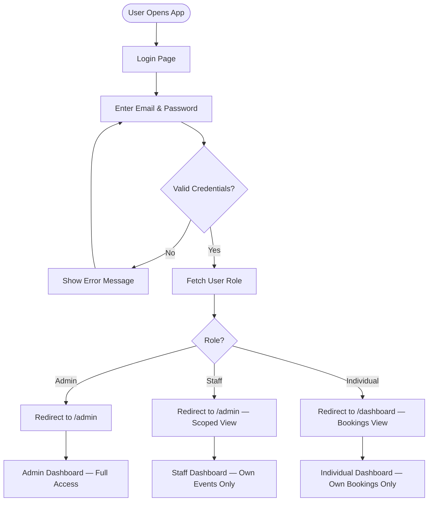

---

## 3. Admin — Staff Management Flow

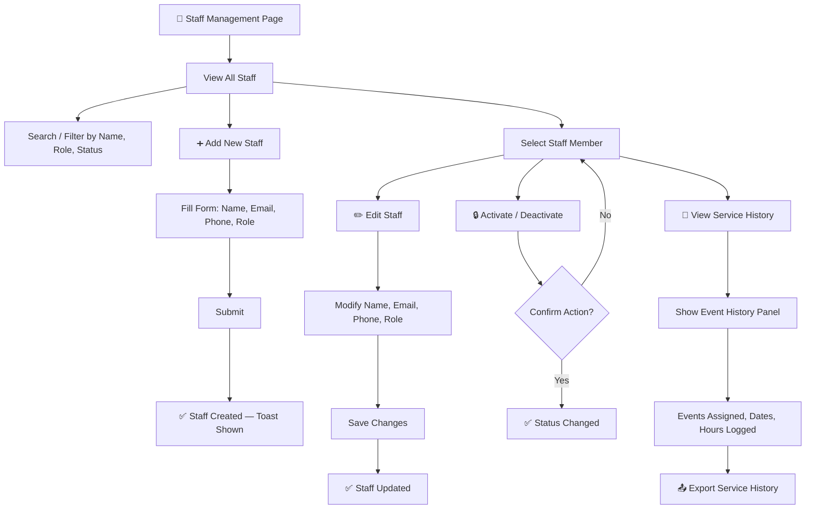

---

## 4. Admin — Staff Availability Flow

```mermaid
flowchart TD
    AvailPage[📅 Staff Availability Page] --> OverviewView[View All Staff Availability]

    OverviewView --> CalendarView[Calendar / Grid View]
    CalendarView --> ColorCoded[🟢 Available | 🔴 Unavailable | 🟡 Partial]
    OverviewView --> FilterDate[Filter by Date Range]

    OverviewView --> SelectStaffAvail[Select Staff Member]
    SelectStaffAvail --> OverrideAvail[Override Availability for Date]
    OverrideAvail --> SetStatus[Set Status + Optional Note]
    SetStatus --> SaveAvail[Save]
    SaveAvail --> Updated[✅ Availability Updated]
```

---

## 5. Admin — Staff-Event Assignment Flow

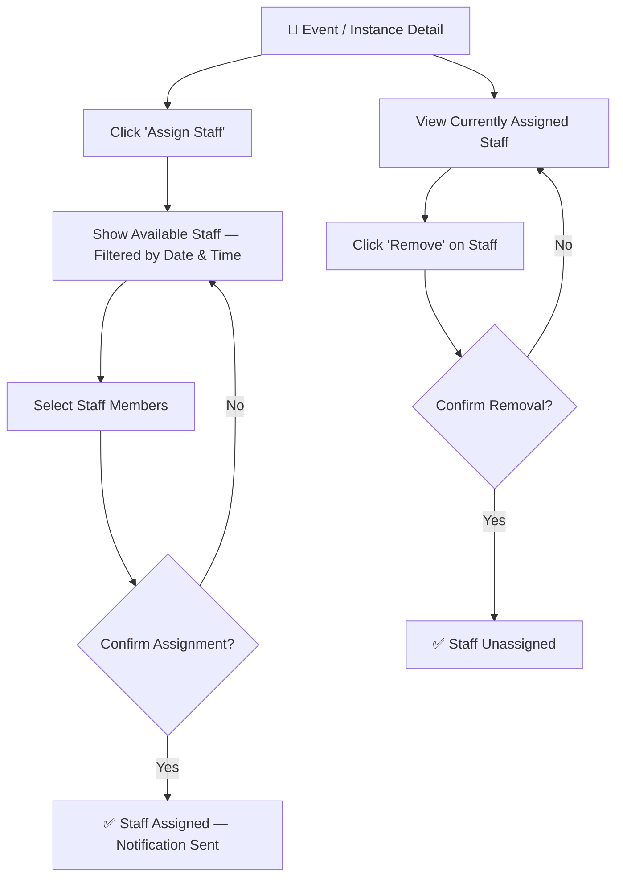

---

## 6. Scheduling Conflict — Overlapping Session Detection

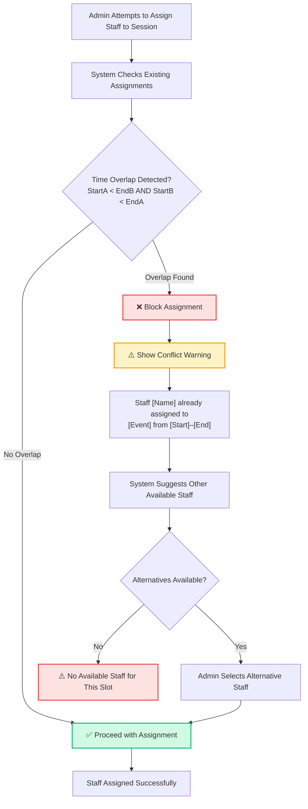

---

## 7. Staff on Leave / Unavailable — Assignment Filter Flow

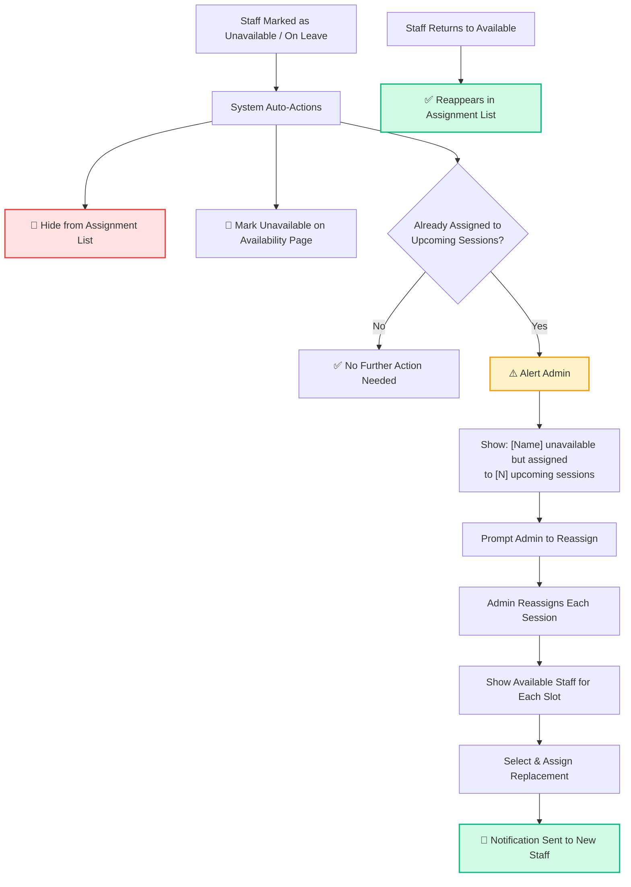

---

## 8. Last-Minute Staff Absence — Quick Reassignment Flow

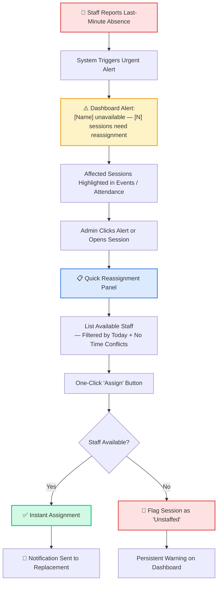

---

## 9. Staff — Event Creation Flow

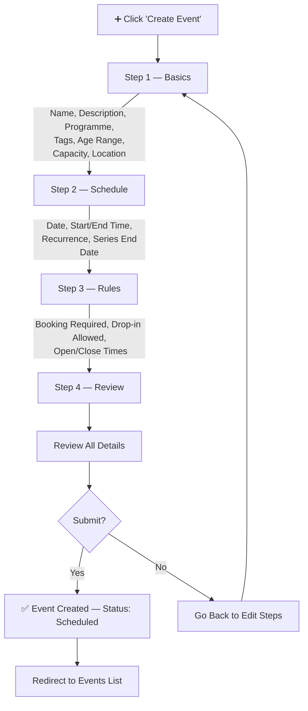

---

## 10. Staff — Attendance Marking Flow

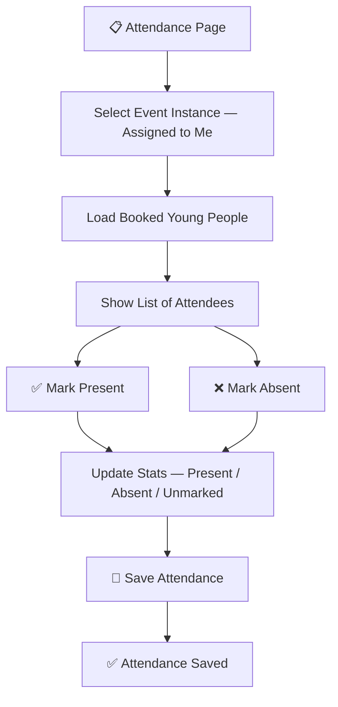

---

## 11. Staff — My Event History Flow

```mermaid
flowchart TD
    HistoryPage[📂 My Event History] --> LoadEvents[Load All Assigned Events]
    LoadEvents --> EventList[Chronological List]
    EventList --> EventEntry[Date | Event Name | Location | Attendance Marked?]

    EventList --> FilterOptions[Filter by Date Range / Event Type]
    FilterOptions --> FilteredList[Filtered Results]

    EventList --> SummaryStats[Summary: Total Events | This Month | This Year]
```

---

## 12. Staff — Availability Toggle Flow

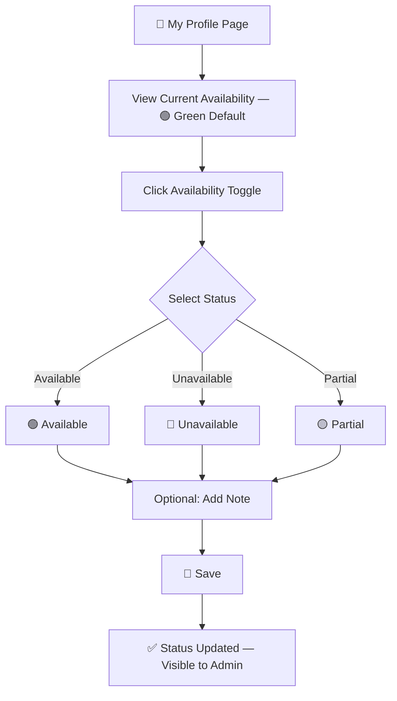

---

## 13. Complete Navigation Map

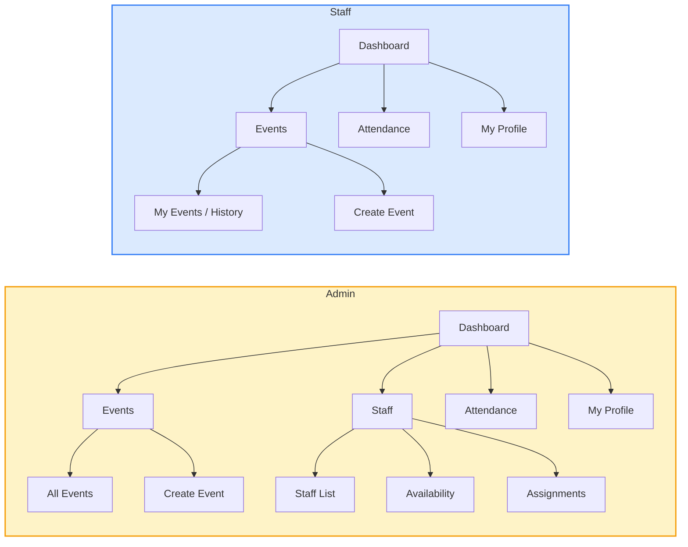

---

## 14. Individual — Browse & Book Sessions Flow

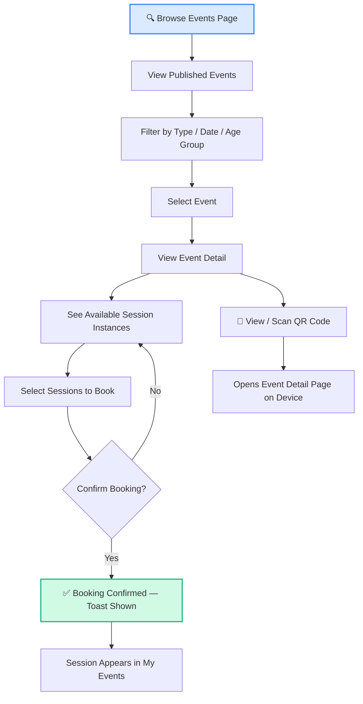

---

## 15. Individual — My Events & Attendance Flow

```mermaid
flowchart TD
    MyEventsPage[📂 My Events Page] --> LoadBookings[Load Booked Sessions]
    LoadBookings --> SplitView{View Type}
    SplitView -->|Upcoming| UpcomingList[Upcoming Sessions List]
    SplitView -->|Past| PastList[Past Sessions List]

    UpcomingList --> SessionCard[Date | Event Name | Time | Venue]
    PastList --> PastCard[Date | Event Name | Attendance Status]

    PastList --> AttendanceStats[📊 Attendance Summary]
    AttendanceStats --> StatsDetail[Total Sessions | Present | Absent | Rate %]

    style MyEventsPage fill:#d1fae5,stroke:#10b981,stroke-width:2px
```

---

## 16. Event Publishing Flow

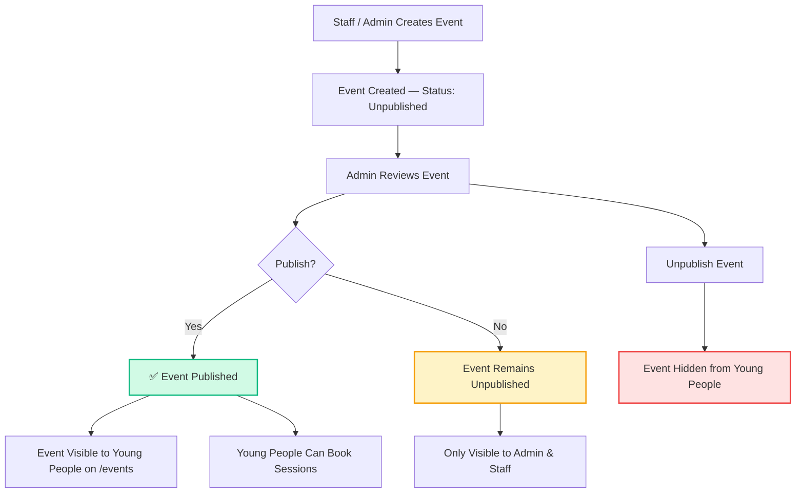

---

## 17. QR Code Booking Flow

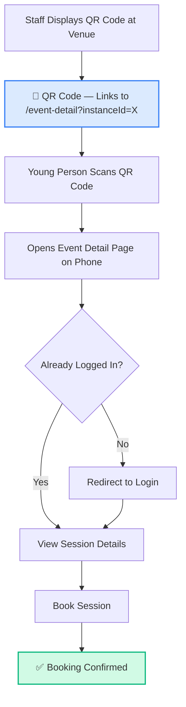

---

## 18. Complete Navigation Map (All Roles)

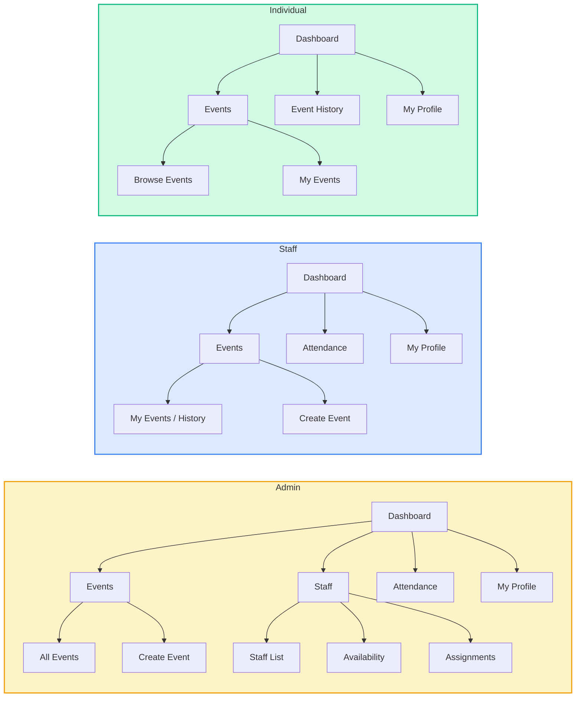
